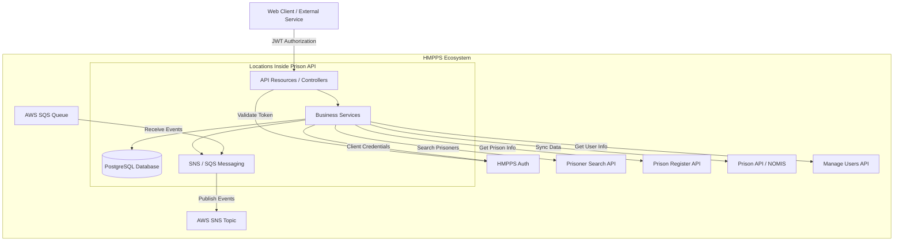

# Architecture

This document describes the architecture of the HMPPS Locations Inside Prison API.

## Overview

The Locations Inside Prison API is a Spring Boot application written in Kotlin. It provides a centralized service for managing and reporting on locations within a prison environment, such as cells, wings, and non-residential areas.

## Components

### Internal Components

1.  **Resources (Controllers)**:
    -   **LocationResource**: Handles general CRUD operations for locations.
    -   **Residential/Non-Residential Resources**: Specialized endpoints for different location types.
    -   **PrisonerLocationResource**: Manages the mapping between prisoners and their assigned locations.
    -   **SyncResource**: Facilitates synchronization of location data from external legacy systems (e.g., NOMIS).
    -   **PrisonRollResource**: Provides prisoner counts and occupancy data for locations.

2.  **Services**:
    -   **LocationService**: Orchestrates business logic for managing location data and its lifecycle.
    -   **PrisonerLocationService**: Logic for tracking which prisoners are in which locations.
    -   **PrisonerSearchService**: Interacts with the Prisoner Search API to retrieve detailed prisoner information.
    -   **EventPublishAndAuditService**: Manages the publication of domain events and auditing of changes.
    -   **SnsService**: Handles communication with AWS SNS for publishing domain events.

3.  **Data Access**:
    -   **PostgreSQL**: The primary relational database for storing location data.
    -   **JPA/Hibernate**: Used for object-relational mapping.
    -   **Flyway**: Manages database schema migrations.

4.  **Messaging**:
    -   **AWS SNS**: Used to publish domain events (e.g., `location.inside.prison.created`) to notify other HMPPS services of changes.
    -   **AWS SQS**: Used to listen for events from external systems that might require updates within this API.

### External Calls

The API interacts with several other HMPPS services:

-   **HMPPS Auth**: Validates JWT tokens and provides authentication/authorization services.
-   **Prisoner Search API**: Used to fetch up-to-date prisoner details associated with locations.
-   **Prison Register API**: Provides definitive information about prisons (e.g., names, IDs).
-   **Prison API (NOMIS)**: Interacts with legacy prison data systems for synchronization and historical data. This API both calls the Prison API and receives synchronization updates from NOMIS-related services via specialized sync endpoints.
-   **Manage Users API**: Used to retrieve information about users interacting with the system.

## Security

The API's endpoints are protected using **OAuth2** with **HMPPS Auth** as the identity provider.

### Authentication and Validation
-   **JWT Bearer Tokens**: Incoming requests must include a valid JSON Web Token (JWT) in the `Authorization` header.
-   **Token Validation**: The API validates the JWT signature using public keys (JWKS) fetched from the `${api.base.url.oauth}/.well-known/jwks.json` endpoint of the HMPPS Auth service. It also verifies standard claims such as issuer (`iss`), expiry (`exp`), and audience (`aud`).
-   **Spring Security**: The application uses `Spring Security OAuth2 Resource Server` to intercept and validate calls.

### Authorization
-   **Roles and Scopes**: Access control is enforced based on the roles and scopes present within the JWT.
-   **Endpoint Protection**: Granular access control is implemented using Spring Security's `@PreAuthorize` annotations on resource methods (e.g., `hasRole('ROLE_LOCATIONS_INSIDE_PRISON_RW')`) or through configuration in `ResourceServerConfiguration`.
-   **Service-to-Service**: For internal calls between services, a client credentials grant is typically used, with the `SYSTEM_USERNAME` identifying the calling system.

## Architecture Diagram

The following diagram illustrates the relationship between the internal components and external services:

