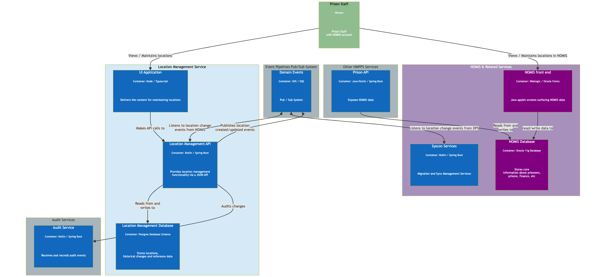

# 1. Architecture Overview
Locations inside prison service

[Next >>](0003-nomis-sync-and-migration.md)

Date: 2024-01-23

## Status

Accepted

## Context

This document illustrate where the **locations inside prison service** fits into the wider architecture.

### Components
High level set of components that would make up the internal location management service.

#### Proposed Architecture
The proposed architecture for location management follows a similar pattern to existing services:

- Locations Inside Prison API

- UI Application to allow creation of to locations, viewing and managing existing locations and configuring cells, etc

- A database to store locations, reference data and configuration

- Domain events to indicate new and changes to location information

Below illustrate these components and how they interact with each other.

[Next >>](0003-nomis-sync-and-migration.md)