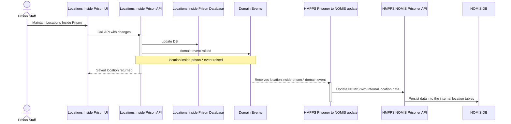
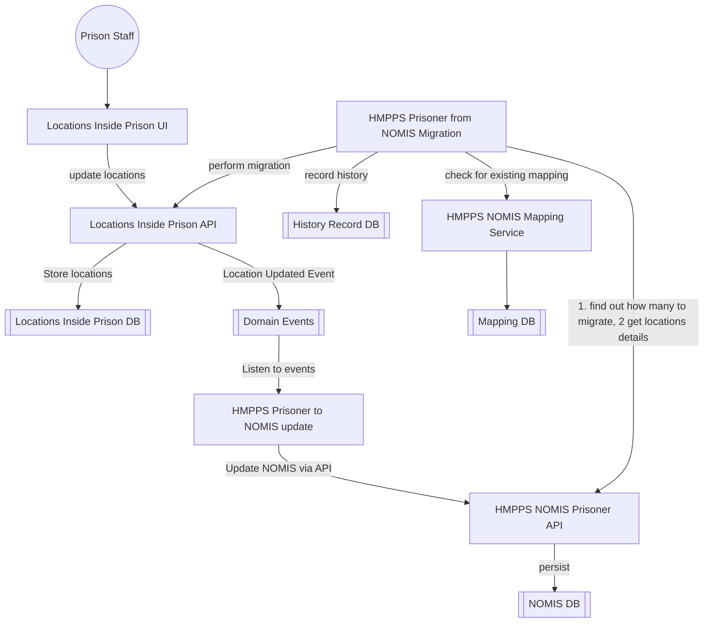

# 1. Mastering and synchronisation of Internal location data with NOMIS

[Next >>](0004-location-db-design.md)


Date: 2024-01-23

## Status

Accepted

## Context

This document will cover the approach for the locations inside prison service to "own" the internal location data and synchronisation this information back into NOMIS

### Migration plan for "Locations Inside Prison Service" - Moving data off NOMIS approach
A two-way sync and migration pattern is to be adopted.

Therefore, the approach will be to :-
- Keep NOMIS up to date with changes made in Locations Inside Prison Service
- Provide a two-way sync and keep both systems in synchronisation so that turning off access to old NOMIS screens can be done prison by prison
- Migrate all the data from NOMIS
- Once all prisons had been switched over - turn off NOMIS -> DPS sync (now 1 way only)
- All access to screen removed

Steps taken:
The Move a Prisoner Team.
- Model the Locations Inside Prison data in a new database 
- Build API functionality for managing the data 
- Provide Locations Inside Prison endpoint in API that mirrors data in NOMIS
- Raise events on creation or amendments of locations
- Build a "sync" and "migrate" endpoints to allow NOMIS to send location data to Locations Inside Prison API

On NOMIS (syscon)
- Call Locations Inside Prison API "sync" endpoints when any updates where made to internal location data in NOMIS
- Listen to events when locations where created in DPS and store them in NOMIS
- Migrate all the data held on internal locations in NOMIS by calling API "migrate" endpoint
- Reconcile mismatches with weekly checks
- Remove all location endpoints in prison-api once all services are using new API

Data is still held in NOMIS and will be maintained for existing processes to continue to function.

### NOMIS synchronisation sequence
When a change is made to a location either a creation or update, events are be fired. The sequence of events for syncing back to NOMIS is shown below:



## Key components and their flow for internal locations sync



#### Domain Event Types:
In all instances the domain event will contain the unique reference to a location.
- location.inside.prison.created 
- location.inside.prison.amended
- location.inside.prison.deactivated
- location.inside.prison.reactivated
- location.inside.prison.capacity.changed
- location.inside.prison.certification.changed
- location.inside.prison.deleted

**Example:**
```json
{
  "eventType": "location.inside.prison.amended",
  "occurredAt": "2023-03-14T10:00:00",
  "version": "1.0",
  "description": "Location LEI-A-1-003 amended",
  "additionalInformation": {
    "locationId": "38c862ee-dbd8-4774-bdd2-499092a4a01e",
    "locationKey": "LEI-A-1-003"
  }
}
```


## API endpoints for sync

### Sync endpoints for locations inside prison
This endpoint will contain all the information need to populate the locations database with a location updated in NOMIS
- `GET /locations/sync/upsert`
- `GET /locations/sync/delete`
- 
### Migration endpoint for locations inside prison
This endpoint will contain all the information need to populate the locations database with a specific location
- `POST /locations/migrate`


## Decision
- Migration process will be trialed in pre-prod and UAT testing will be needed to check mappings have accurately represented location data


[Next >>](0004-location-db-design.md)
