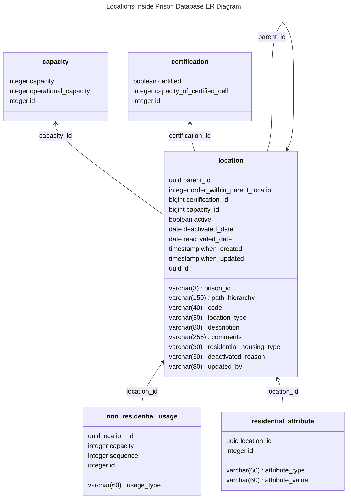
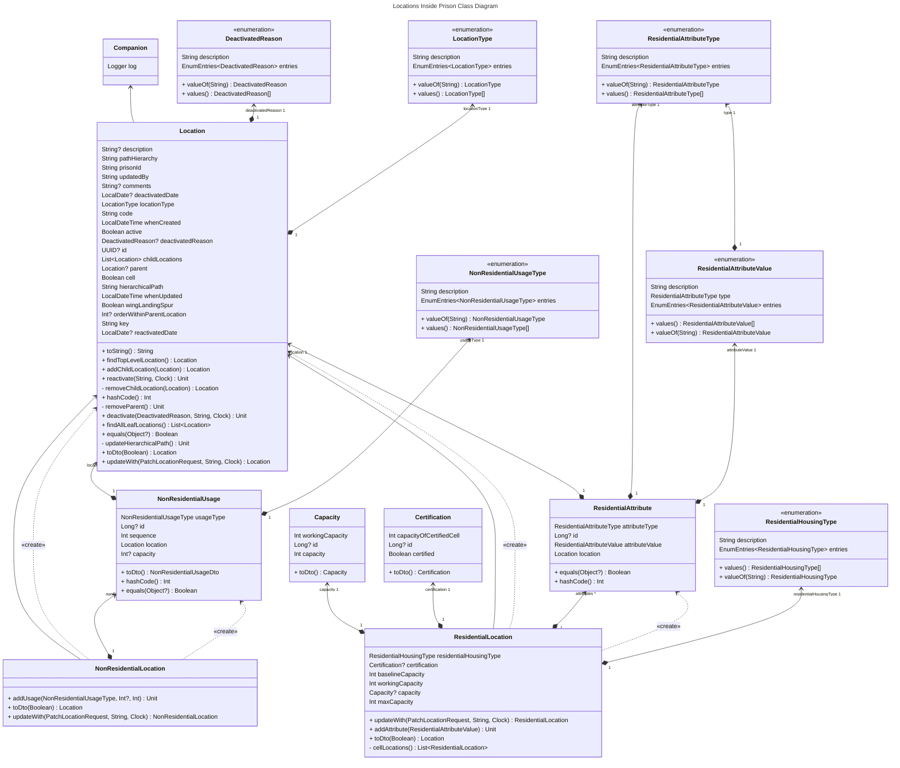

# 1. Database proposed schema for holding locations inside prison

[Next >>](9999-end.md)

Date: 2024-01-24    

## Status

Accepted

## Context
This illustrates the entities that will be held in the database for locations inside prison service

### NOMIS to DPS type translations

#### Location Types
| NOMIS | DPS                 |
|-------|---------------------|
| ADJU  | ADJUDICATION_ROOM   |
| ADMI  | ADMINISTRATION_AREA |
| APP   | APPOINTMENTS        |
| AREA  | AREA                |
| ASSO  | ASSOCIATION         |
| BOOT  | BOOTH               |
| BOX   | BOX                 |
| CELL  | CELL                |
| CLAS  | CLASSROOM           |
| EXER  | EXERCISE_AREA       |
| EXTE  | EXTERNAL_GROUNDS    |
| FAIT  | FAITH_AREA          |
| GROU  | GROUP               |
| HCEL  | HOLDING_CELL        |
| HOLD  | HOLDING_AREA        |
| IGRO  | INTERNAL_GROUNDS    |
| INSI  | INSIDE_PARTY        |
| INTE  | INTERVIEW           |
| LAND  | LANDING             |
| LOCA  | LOCATION            |
| MEDI  | MEDICAL             |
| MOVE  | MOVEMENT_AREA       |
| OFFI  | OFFICE              |
| OUTS  | OUTSIDE_PARTY       |
| POSI  | POSITION            |
| RESI  | RESIDENTIAL_UNIT    |
| ROOM  | ROOM                |
| RTU   | RETURN_TO_UNIT      |
| SHEL  | SHELF               |
| SPOR  | SPORTS              |
| SPUR  | SPUR                |
| STOR  | STORE               |
| TABL  | TABLE               |
| TRAI  | TRAINING_AREA       |
| TRRM  | TRAINING_ROOM       |
| VIDE  | VIDEO_LINK          |
| VISIT | VISIT               |
| WING  | WING                |
| WORK  | WORKSHOP            |
                          
        
### Residential Housing Type
| NOMIS | DPS                      |
|-------|--------------------------|
| HC    | HEALTHCARE               |           
| HOLC  | HOLDING_CELL             |          
| NA    | NORMAL_ACCOMMODATION     |     
| OU    | OTHER_USE                | 
| REC   | RECEPTION                |
| SEG   | SEGREGATION              | 
| SPLC  | SPECIALIST_CELL          | 

### LocationAttributeType

| NOMIS        | DPS                  |
|--------------|----------------------|
| NON_ASSO_TYP | NON_ASSOCIATIONS     |
| SUP_LVL_TYPE | SECURITY             |          
| HOU_USED_FOR | USED_FOR             | 
| HOU_UNIT_ATT | LOCATION_ATTRIBUTE   | 
| HOU_SANI_FIT | SANITATION_FITTINGS  | 

### LocationUsageType

| NOMIS    | DPS                    |   
|----------|------------------------|
| APP      | APPOINTMENT            |
| MOVEMENT | MOVEMENT               |
| OCCUR    | OCCURRENCE             |
| OIC      | ADJUDICATION_HEARING   |
| OTHER    | OTHER                  |
| PROG     | PROGRAMMES_ACTIVITIES  |
| PROP     | PROPERTY               |
| VISIT    | VISIT                  |

### DeactivatedReason
| NOMIS | DPS                     |
|-------|-------------------------|
| A     | NEW_BUILDING            |
| B     | CELL_RECLAIMS           |
| C     | CHANGE_OF_USE           |
| D     | REFURBISHMENT           |
| E     | CLOSURE                 |
| F     | OTHER                   |    
| G     | LOCAL_WORK              |
| H     | STAFF_SHORTAGE          |
| I     | MOTHBALLED              |
| J     | DAMAGED                 |
| K     | OUT_OF_USE              |
| L     | CELLS_RETURNING_TO_USE  |

### LocationAttributeValue
| NOMIS Type   | Value    | Meaning                                         | DPS                          |
|--------------|----------|-------------------------------------------------|------------------------------|
| HOU_SANI_FIT | ACB      | Auditable Cell Bell                             | ANTI_BARRICADE_DOOR          |
| HOU_SANI_FIT | ABD      | Anti Barricade Door                             | AUDITABLE_CELL_BELL          |
| HOU_SANI_FIT | FIB	     | Fixed Bed                                       | FIXED_BED                    |    
| HOU_SANI_FIT | MD	      | Metal Door                                      | METAL_DOOR                   | 
| HOU_SANI_FIT | MOB	     | Movable Bed                                     | MOVABLE_BED                  |    
| HOU_SANI_FIT | PC	      | Privacy Curtain                                 | PRIVACY_CURTAIN              | 
| HOU_SANI_FIT | PS	      | Privacy Screen                                  | PRIVACY_SCREEN               | 
| HOU_SANI_FIT | SCB	     | Standard Cell Bell                              | STANDARD_CELL_BELL           |    
| HOU_SANI_FIT | SETO     | Separate Toilet                                 | SEPARATE_TOILET              |
| HOU_SANI_FIT | WD	      | Wooden Door                                     | WOODEN_DOOR                  | 
| HOU_UNIT_ATT | A	       | Cat A Cell                                      | CAT_A_CELL                   |
| HOU_UNIT_ATT | DO	      | Double Occupancy                                | DOUBLE_OCCUPANCY             | 
| HOU_UNIT_ATT | ELC	     | E List Cell                                     | E_LIST_CELL                  |    
| HOU_UNIT_ATT | GC	      | Gated Cell                                      | GATED_CELL                   | 
| HOU_UNIT_ATT | LC	      | Listener Cell                                   | LISTENER_CELL                | 
| HOU_UNIT_ATT | LF	      | Locate Flat                                     | LOCATE_FLAT                  | 
| HOU_UNIT_ATT | MO	      | Multiple Occupancy                              | MULTIPLE_OCCUPANCY           | 
| HOU_UNIT_ATT | NSMC     | Non Smoker Cell                                 | NON_SMOKER_CELL              |
| HOU_UNIT_ATT | OC	      | Observation Cell                                | OBSERVATION_CELL             | 
| HOU_UNIT_ATT | SC	      | Safe Cell                                       | SAFE_CELL                    | 
| HOU_UNIT_ATT | SO	      | Single Occupancy                                | SINGLE_OCCUPANCY             | 
| HOU_UNIT_ATT | SPC	     | Special Cell                                    | SPECIAL_CELL                 |    
| HOU_UNIT_ATT | WA	      | Wheelchair Access                               | WHEELCHAIR_ACCESS            | 
| HOU_USED_FOR | 1	       | Unconvicted Juveniles                           | UNCONVICTED_JUVENILES        |
| HOU_USED_FOR | 10	      | Healthcare Centre                               | HEALTHCARE_CENTRE            |
| HOU_USED_FOR | 11	      | National Resource Hospital                      | NATIONAL_RESOURCE_HOSPITAL   |
| HOU_USED_FOR | 12	      | Other (Please Specify)                          | OTHER_SPECIFIED              |
| HOU_USED_FOR | 2	       | Sentenced Juveniles                             | SENTENCED_JUVENILES          |
| HOU_USED_FOR | 3	       | Unconvicted 18 to 20 year olds                  | UNCONVICTED_18_20            |
| HOU_USED_FOR | 4	       | Sentenced 18 to 20 year olds                    | SENTENCED_18_20              |
| HOU_USED_FOR | 5	       | Unconvicted Adults                              | UNCONVICTED_ADULTS           |
| HOU_USED_FOR | 6	       | Sentenced Adults                                | SENTENCED_ADULTS             |
| HOU_USED_FOR | 7	       | Vulnerable Prisoner Unit                        | VULNERABLE_PRISONER_UNIT     |
| HOU_USED_FOR | 8	       | Special Unit                                    | SPECIAL_UNIT                 |
| HOU_USED_FOR | 9	       | Resettlement Hostel                             | RESETTLEMENT_HOSTEL          |
| HOU_USED_FOR | A	       | Remand Centre                                   | REMAND_CENTRE                |
| HOU_USED_FOR | B	       | Local Prison                                    | LOCAL_PRISON                 |
| HOU_USED_FOR | C	       | Closed Prison                                   | CLOSED_PRISON                |
| HOU_USED_FOR | D	       | Open Training                                   | OPEN_TRAINING                |
| HOU_USED_FOR | E	       | Hostel                                          | HOSTEL                       |
| HOU_USED_FOR | H	       | National Resource Hospital                      | NATIONAL_RESOURCE_HOSPITAL   |
| HOU_USED_FOR | I	       | Closed Young Offender Institute                 | CLOSED_YOUNG_OFFENDER        |
| HOU_USED_FOR | J	       | Open Young Offender Institute                   | OPEN_YOUNG_OFFENDER          |
| HOU_USED_FOR | K	       | Remand Institute for Under 18s                  | REMAND_UNDER_18              |
| HOU_USED_FOR | L	       | Institution for Sentenced Under 18s             | SENTENCED_UNDER_18           |
| HOU_USED_FOR | R	       | ECL Component Code                              | ECL_COMPONENT                |
| HOU_USED_FOR | S	       | Special Unit                                    | SPECIAL_UNIT			              |
| HOU_USED_FOR | T	       | Additional Special Unit                         | ADDITIONAL_SPECIAL_UNIT			   |
| HOU_USED_FOR | V	       | Vulnerable Prisoner Unit                        | VULNERABLE_PRISONER_UNIT     |
| HOU_USED_FOR | Y	       | Second Closed Trainer/Single LIDS Site          | SECOND_CLOSED_TRAINER        |
| HOU_USED_FOR | Z	       | Immigration Detainees                           | IMMIGRATION_DETAINEES        |
| NON_ASSO_TYP | CELL     | Do Not Locate in Same Cell                      | CELL                         |
| NON_ASSO_TYP | LAND     | Do Not Locate on Same Landing                   | LANDING                      |
| NON_ASSO_TYP | NONE     | Do Not Exercise Together                        |                              |
| NON_ASSO_TYP | TNA      | Total Non Association                           |                              |
| NON_ASSO_TYP | WING     | Do Not Locate on Same Wing                      | WING                         |
| SUP_LVL_TYPE | A	       | Cat A                                           | CAT_A                        |
| SUP_LVL_TYPE | B	       | Cat B                                           | CAT_B                        |
| SUP_LVL_TYPE | C	       | Cat C                                           | CAT_C                        |
| SUP_LVL_TYPE | D	       | Cat D                                           | CAT_D                        |
| SUP_LVL_TYPE | H	       | Cat A Hi                                        | CAT_A_HI                     |
| SUP_LVL_TYPE | E	       | Cat A Ex                                        | CAT_A_EX                     |
| SUP_LVL_TYPE | EL	      | Eligible                                        | ELIGIBLE                     |
| SUP_LVL_TYPE | GRANTED  | Parole Granted                                  | PAROLE_GRANTED               |
| SUP_LVL_TYPE | I	       | YOI Closed                                      | YOI_CLOSED                   |
| SUP_LVL_TYPE | INEL     | Ineligible                                      | INELIGIBLE                   |
| SUP_LVL_TYPE | J	       | YOI Open                                        | YOI_OPEN                     |
| SUP_LVL_TYPE | K	       | YOI Short Sentence                              | YOI_SHORT_SENTENCE           |
| SUP_LVL_TYPE | L	       | YOI Long-Term Closed                            | YOI_LONG_TERM_CLOSED         |
| SUP_LVL_TYPE | HI	      | High                                            | HIGH                         |
| SUP_LVL_TYPE | MED	     | Medium                                          | MEDIUM                       |
| SUP_LVL_TYPE | LOW	     | Low                                             | LOW                          |
| SUP_LVL_TYPE | STANDARD | Standard                                        | STANDARD                     |
| SUP_LVL_TYPE | Y	       | Yes                                             | YES                          |
| SUP_LVL_TYPE | N        | No                                              | NO                           |
| SUP_LVL_TYPE | N/A      | Not Applicable                                  | NOT_APPLICABLE               |
| SUP_LVL_TYPE | NA	      | Not Applicable                                  | NOT_APPLICABLE               |
| SUP_LVL_TYPE | P	       | Prov A                                          | PROV_A                       |
| SUP_LVL_TYPE | PEND     | Pending                                         | PENDING                      |
| SUP_LVL_TYPE | Q	       | Female Restricted                               | FEMALE_RESTRICTED            |
| SUP_LVL_TYPE | R	       | Female Closed                                   | FEMALE_CLOSED                |
| SUP_LVL_TYPE | REF/REVIEW | Ref / Review - Date set for Review              | REF_REVIEW                   |
| SUP_LVL_TYPE | REFUSED  | Refused - No Review possible                    | REFUSED_NO_REVIEW            |
| SUP_LVL_TYPE | S	       | Female Semi                                     | FEMALE_SEMI                  |
| SUP_LVL_TYPE | T	       | Female Open                                     | FEMALE_OPEN                  |
| SUP_LVL_TYPE | U	       | Unsentenced                                     | UN_SENTENCED                          |
| SUP_LVL_TYPE | V	       | YOI Restricted                                  | YOI_RESTRICTED               |
| SUP_LVL_TYPE | X	       | Uncategorised Sentenced Male                    | UNCATEGORISED_SENTENCED_MALE |
| SUP_LVL_TYPE | Z	       | Unclass                                         | UNCLASSIFIED                 |
 
### Entity Diagram

[Next >>](9999-end.md)
