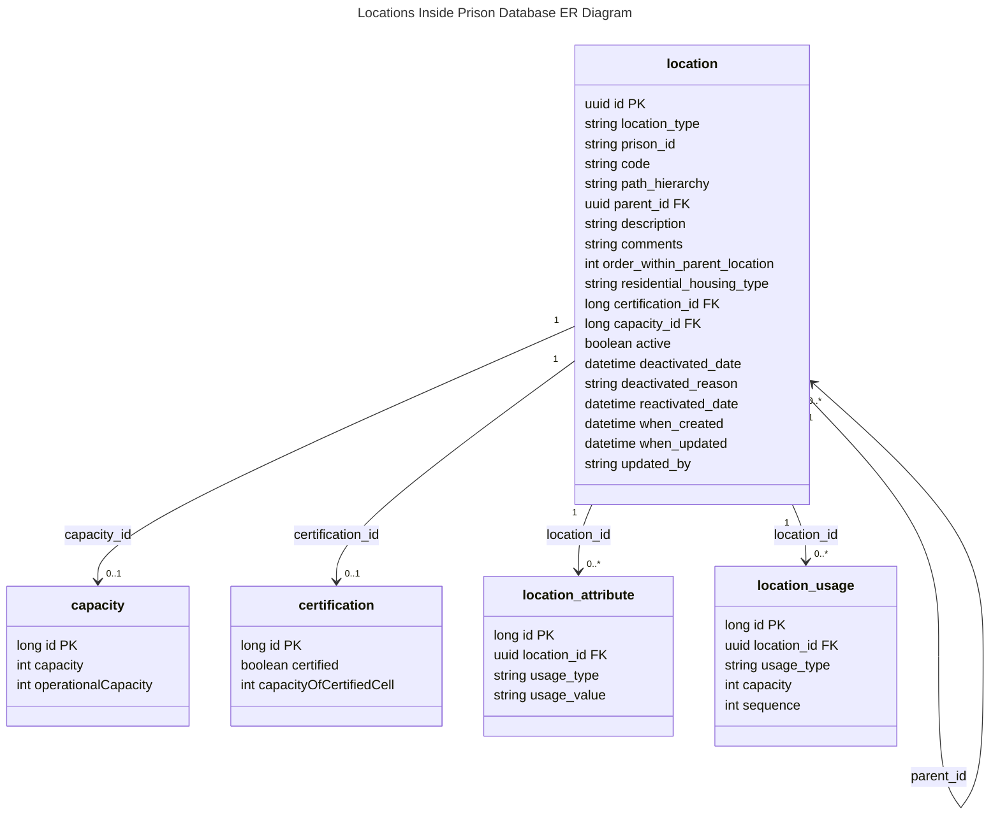
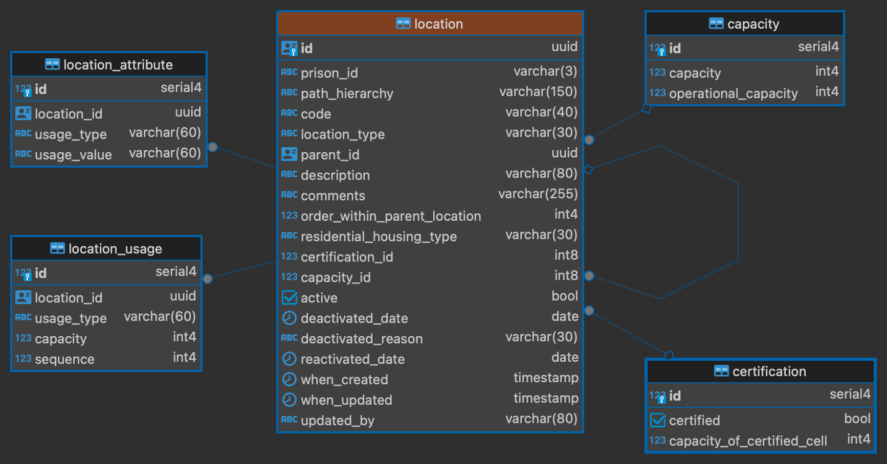

# 1. Database proposed schema for holding locations inside prison

[Next >>](9999-end.md)

Date: 2024-01-24    

## Status

Accepted

## Context
This illustrates the entites that will be held in the database for locations inside prison service

### NOMIS to DPS type translations

#### Location Types
| NOMIS | DPS                 |
|-------|---------------------|
| ADJU  | ADJUDICATION_ROOM   |
| ADMI  | ADMINISTRATION_AREA |
| APP   | APPOINTMENTS        |
| AREA  | AREA                |
| ASSO  | ASSOCIATION         |
| BOOT  | BOOTH               |
| BOX   | BOX                 |
| CELL  | CELL                |
| CLAS  | CLASSROOM           |
| EXER  | EXERCISE_AREA       |
| EXTE  | EXTERNAL_GROUNDS    |
| FAIT  | FAITH_AREA          |
| GROU  | GROUP               |
| HCEL  | HOLDING_CELL        |
| HOLD  | HOLDING_AREA        |
| IGRO  | INTERNAL_GROUNDS    |
| INSI  | INSIDE_PARTY        |
| INTE  | INTERVIEW           |
| LAND  | LANDING             |
| LOCA  | LOCATION            |
| MEDI  | MEDICAL             |
| MOVE  | MOVEMENT_AREA       |
| OFFI  | OFFICE              |
| OUTS  | OUTSIDE_PARTY       |
| POSI  | POSITION            |
| RESI  | RESIDENTIAL_UNIT    |
| ROOM  | ROOM                |
| RTU   | RETURN_TO_UNIT      |
| SHEL  | SHELF               |
| SPOR  | SPORTS              |
| SPUR  | SPUR                |
| STOR  | STORE               |
| TABL  | TABLE               |
| TRAI  | TRAINING_AREA       |
| TRRM  | TRAINING_ROOM       |
| VIDE  | VIDEO_LINK          |
| VISIT | VISIT               |
| WING  | WING                |
| WORK  | WORKSHOP            |
                          
        
### Residential Housing Type
| NOMIS | DPS                      |
|-------|--------------------------|
| HC    | HEALTHCARE               |           
| HOLC  | HOLDING_CELL             |          
| NA    | NORMAL_ACCOMMODATION     |     
| OU    | OTHER_USE                | 
| REC   | RECEPTION                |
| SEG   | SEGREGATION              | 
| SPLC  | SPECIALIST_CELL          | 

### LocationAttributeType

| NOMIS        | DPS                  |
|--------------|----------------------|
| NON_ASSO_TYP | NON_ASSOCIATIONS     |
| SUP_LVL_TYPE | SECURITY             |          
| HOU_USED_FOR | USED_FOR             | 
| HOU_UNIT_ATT | LOCATION_ATTRIBUTE   | 
| HOU_SANI_FIT | SANITATION_FITTINGS  | 

### LocationUsageType

| NOMIS    | DPS                    |   
|----------|------------------------|
| APP      | APPOINTMENT            |
| MOVEMENT | MOVEMENT               |
| OCCUR    | OCCURRENCE             |
| OIC      | ADJUDICATION_HEARING   |
| OTHER    | OTHER                  |
| PROG     | PROGRAMMES_ACTIVITIES  |
| PROP     | PROPERTY               |
| VISIT    | VISIT                  |

### DeactivatedReason
| NOMIS | DPS                     |
|-------|-------------------------|
| A     | NEW_BUILDING            |
| B     | CELL_RECLAIMS           |
| C     | CHANGE_OF_USE           |
| D     | REFURBISHMENT           |
| E     | CLOSURE                 |
| F     | OTHER                   |    
| G     | LOCAL_WORK              |
| H     | STAFF_SHORTAGE          |
| I     | MOTHBALLED              |
| J     | DAMAGED                 |
| K     | OUT_OF_USE              |
| L     | CELLS_RETURNING_TO_USE  |

### LocationAttributeValue
| NOMIS Type   | Value      | Meaning                                | DPS  |
|--------------|------------|----------------------------------------|------|
| HOU_SANI_FIT | ACB        | Auditable Cell Bell                    | ACB  |
| HOU_SANI_FIT | ABD        | Anti Barricade Door                    | ABD  |
| HOU_SANI_FIT | FIB	       | Fixed Bed                              | FIB  |
| HOU_SANI_FIT | MD	        | Metal Door                             | MD   |
| HOU_SANI_FIT | MOB	       | Movable Bed                            | MOB  |
| HOU_SANI_FIT | PC	        | Privacy Curtain                        | PC   |
| HOU_SANI_FIT | PS	        | Privacy Screen                         | PS   |
| HOU_SANI_FIT | SCB	       | Standard Cell Bell                     | SCB  |
| HOU_SANI_FIT | SETO       | 	Separate Toilet                       | SETO |
| HOU_SANI_FIT | WD	        | Wooden Door                            | XXX  |
| HOU_UNIT_ATT | A	         | Cat A Cell                             | XXX  |
| HOU_UNIT_ATT | DO	        | Double Occupancy                       | XXX  |
| HOU_UNIT_ATT | ELC	       | E List Cell                            | XXX  |
| HOU_UNIT_ATT | GC	        | Gated Cell                             | XXX  |
| HOU_UNIT_ATT | LC	        | Listener Cell                          | XXX  |
| HOU_UNIT_ATT | LF	        | Locate Flat                            | XXX  |
| HOU_UNIT_ATT | MO	        | Multiple Occupancy                     | XXX  |
| HOU_UNIT_ATT | NSMC       | 	Non Smoker Cell                       | XXX  |
| HOU_UNIT_ATT | OC	        | Observation Cell                       | XXX  |
| HOU_UNIT_ATT | SC	        | Safe Cell                              | XXX  |
| HOU_UNIT_ATT | SO	        | Single Occupancy                       | XXX  |
| HOU_UNIT_ATT | SPC	       | Special Cell                           | XXX  |
| HOU_UNIT_ATT | WA	        | Wheelchair Access                      | XXX  |
| HOU_USED_FOR | 1	         | Unconvicted Juveniles                  | XXX  |
| HOU_USED_FOR | 	10	       | Healthcare Centre                      | XXX  |
| HOU_USED_FOR | 	11	       | National Resource Hospital             | XXX  |
| HOU_USED_FOR | 	12	       | Other (Please Specify)                 | XXX  |
| HOU_USED_FOR | 	2	        | Sentenced Juveniles                    | XXX  |
| HOU_USED_FOR | 	3	        | Unconvicted 18 to 20 year olds         | XXX  |
| HOU_USED_FOR | 	4	        | Sentenced 18 to 20 year olds           | XXX  |
| HOU_USED_FOR | 	5	        | Unconvicted Adults                     | XXX  |
| HOU_USED_FOR | 	6	        | Sentenced Adults                       | XXX  |
| HOU_USED_FOR | 	7	        | Vulnerable Prisoner Unit               | XXX  |
| HOU_USED_FOR | 	8	        | Special Unit                           | XXX  |
| HOU_USED_FOR | 	9	        | Resettlement Hostel                    | XXX  |
| HOU_USED_FOR | 	A	        | Remand Centre                          | XXX  |
| HOU_USED_FOR | 	B	        | Local Prison                           | XXX  |
| HOU_USED_FOR | 	C	        | Closed Prison                          | XXX  |
| HOU_USED_FOR | 	D	        | Open Training                          | XXX  |
| HOU_USED_FOR | 	E	        | Hostel                                 | XXX  |
| HOU_USED_FOR | 	H	        | National Resource Hospital             | XXX  |
| HOU_USED_FOR | 	I	        | Closed Young Offender Institute        | XXX  |
| HOU_USED_FOR | 	J	        | Open Young Offender Institute          | XXX  |
| HOU_USED_FOR | 	K	        | Remand Institute for Under 18s         | XXX  |
| HOU_USED_FOR | 	L	        | Institution for Sentenced Under 18s    | XXX  |
| HOU_USED_FOR | 	R	        | ECL Component Code                     | XXX  |
| HOU_USED_FOR | 	S	        | Special Unit                           | XXX  |
| HOU_USED_FOR | 	T	        | Additional Special Unit                | XXX  |
| HOU_USED_FOR | 	V	        | Vulnerable Prisoner Unit               | XXX  |
| HOU_USED_FOR | 	Y	        | Second Closed Trainer/Single LIDS Site | XXX  |
| HOU_USED_FOR | 	Z	        | Immigration Detainees                  | XXX  |
| NON_ASSO_TYP | 	CELL      | 	Do Not Locate in Same Cell            | XXX  |
| NON_ASSO_TYP | 	LAND      | 	Do Not Locate on Same Landing         | XXX  |
| NON_ASSO_TYP | 	NONE X    | 	Do Not Exercise Together              | XXX  |
| NON_ASSO_TYP | 	TNA	      | Total Non Association                  | XXX  |
| NON_ASSO_TYP | 	WING      | 	Do Not Locate on Same Wing            | XXX  |
| SUP_LVL_TYPE | 	A	        | Cat A                                  | XXX  |
| SUP_LVL_TYPE | 	B	        | Cat B                                  | XXX  |
| SUP_LVL_TYPE | 	C	        | Cat C                                  | XXX  |
| SUP_LVL_TYPE | 	D	        | Cat D                                  | XXX  |
| SUP_LVL_TYPE | 	E	        | Cat A Ex                               | XXX  |
| SUP_LVL_TYPE | 	EL	       | Eligible                               | XXX  |
| SUP_LVL_TYPE | 	GRANTED   | 	Parole Granted                        | XXX  |
| SUP_LVL_TYPE | 	H	        | Cat A Hi                               | XXX  |
| SUP_LVL_TYPE | 	HI	       | High                                   | XXX  |
| SUP_LVL_TYPE | 	I	        | YOI Closed                             | XXX  |
| SUP_LVL_TYPE | 	INEL      | 	Ineligible                            | XXX  |
| SUP_LVL_TYPE | 	J	        | YOI Open                               | XXX  |
| SUP_LVL_TYPE | 	K	        | YOI Short Sentence                     | XXX  |
| SUP_LVL_TYPE | 	L	        | YOI Long-Term Closed                   | XXX  |
| SUP_LVL_TYPE | 	LOW	      | Low                                    | XXX  |
| SUP_LVL_TYPE | 	MED	      | Medium                                 | XXX  |
| SUP_LVL_TYPE | 	N	        | No                                     | XXX  |
| SUP_LVL_TYPE | 	N/A	      | Not Applicable                         | XXX  |
| SUP_LVL_TYPE | 	NA	       | Not Applicable                         | XXX  |
| SUP_LVL_TYPE | 	P	        | Prov A                                 | XXX  |
| SUP_LVL_TYPE | 	PEND      | 	Pending                               | XXX  |
| SUP_LVL_TYPE | 	Q	        | Female Restricted                      | XXX  |
| SUP_LVL_TYPE | 	R	        | Female Closed                          | XXX  |
| SUP_LVL_TYPE | REF/REVIEW | Ref / Review - Date set for Review     | XXX  |
| SUP_LVL_TYPE | 	REFUSED   | Refused - No Review possible           | XXX  |
| SUP_LVL_TYPE | 	S	        | Female Semi                            | XXX  |
| SUP_LVL_TYPE | 	STANDARD  | 	Standard                              | XXX  |
| SUP_LVL_TYPE | 	T	        | Female Open                            | XXX  |
| SUP_LVL_TYPE | 	U	        | Unsentenced                            | XXX  |
| SUP_LVL_TYPE | 	V	        | YOI Restricted                         | XXX  |
| SUP_LVL_TYPE | 	X	        | Uncategorised Sentenced Male           | XXX  |
| SUP_LVL_TYPE | 	Y	        | Yes                                    | XXX  |
| SUP_LVL_TYPE | 	Z	        | Unclass                                | XXX  |

[Next >>](9999-end.md)