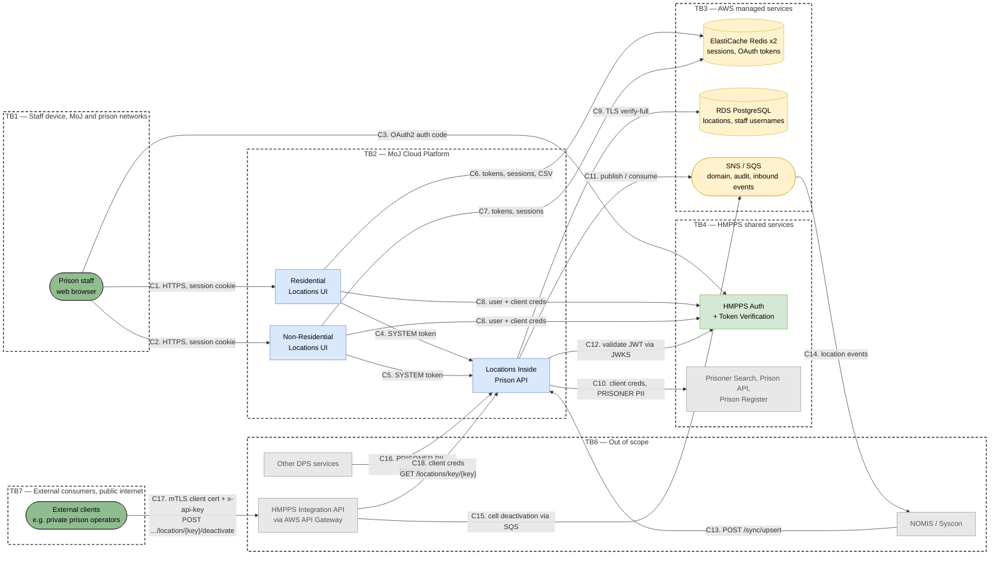
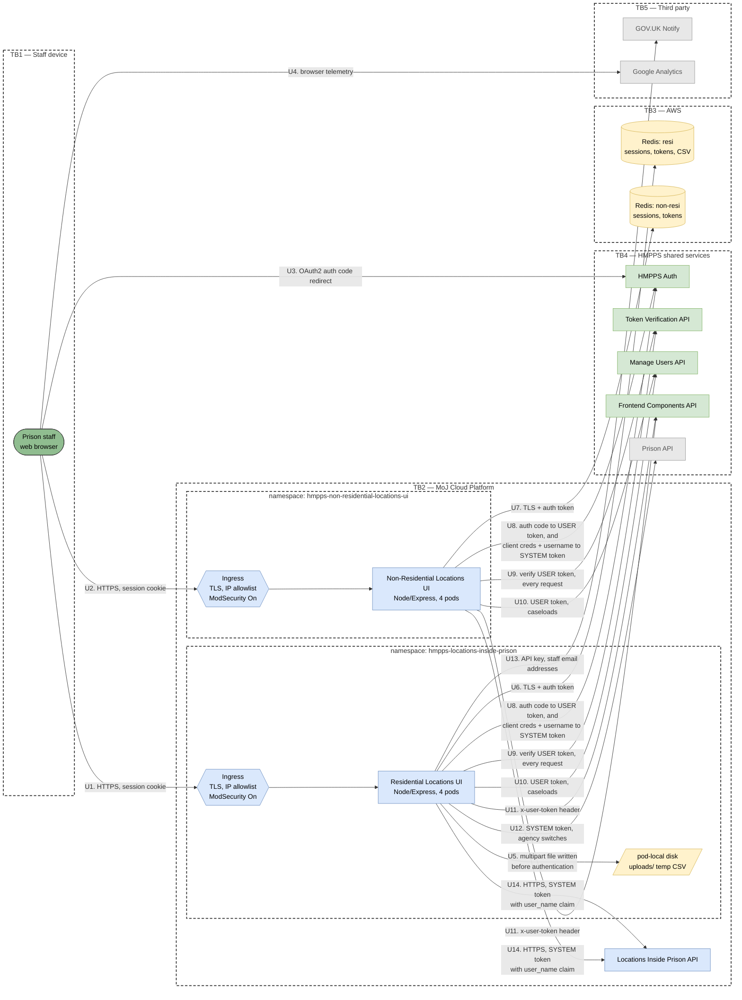
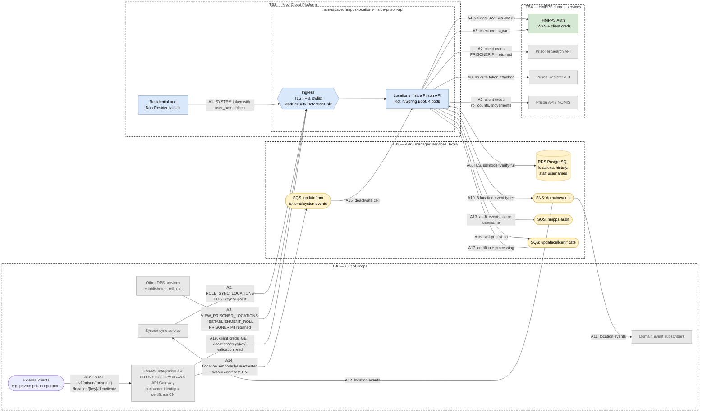
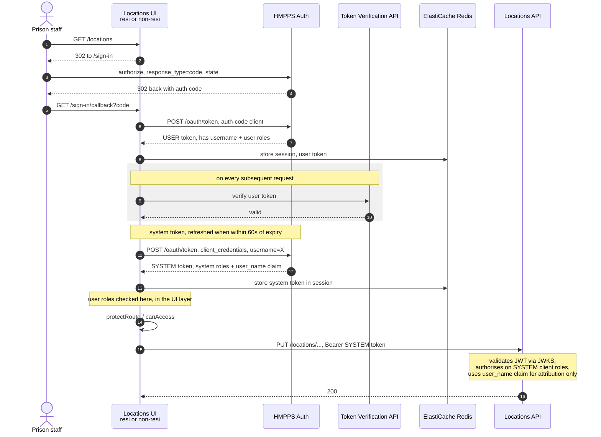

# Data Flow Diagram — Locations Inside Prison

This diagram shows how data moves through the Locations service and where it crosses **trust boundaries** — the points where the level of trust changes. It is maintained for threat modelling (STRIDE) and covers all three components of the service:

| Component | Repo | Description |
| --- | --- | --- |
| Locations Inside Prison API | [`hmpps-locations-inside-prison-api`](https://github.com/ministryofjustice/hmpps-locations-inside-prison-api) | Kotlin / Spring Boot. The shared backend and system of record. |
| Residential Locations UI | [`hmpps-locations-inside-prison`](https://github.com/ministryofjustice/hmpps-locations-inside-prison) | Node / TypeScript. Cells, wings, capacity and certification. |
| Non-Residential Locations UI | [`hmpps-non-residential-locations-ui`](https://github.com/ministryofjustice/hmpps-non-residential-locations-ui) | Node / TypeScript. Gyms, chapels, workshops, property. |

For the static structure of the service, see the [High Level Design](high-level-design.md).

## How to read these diagrams

- **Trust boundaries** are drawn as **dashed boxes**. Data crossing one is where the threat model focuses.
- **Out of scope** services are drawn in grey but kept on the diagram, so the movement of data through them stays visible.
- **Flows are numbered and prefixed** so they can be cited from the STRIDE and risk-scoring tables: `C*` for the context diagram, `U*` for the UI layer, `A*` for the API layer.
- The diagram is split into a context view and two decompositions. A single combined diagram was tried and was not legible.

| Shape | Meaning |
| --- | --- |
| Rounded green | Human actor |
| Blue rectangle | Process we own |
| Yellow cylinder / stadium | Data store or queue |
| Green rectangle | HMPPS service we depend on |
| Grey rectangle | Out of scope |
| Hexagon | Ingress / boundary control point |

## Context diagram

The whole service in one view.

## UI layer

Both UIs follow the same pattern. Flows `U8`–`U11` and `U14` occur identically from each.

### Differences between the two UIs

| | Residential UI | Non-Residential UI |
| --- | --- | --- |
| Product ID | `DPS038` | `DPS120` |
| Prod hostname | `locations-inside-prison.hmpps.service.justice.gov.uk` | `non-residential-locations.hmpps.service.justice.gov.uk` |
| Session cookie | `hmpps-locations-inside-prison.session` | `hmpps-non-residential-locations-ui.session` |
| Extra downstreams | Prison API, GOV.UK Notify | none |
| File upload | Cell certificate CSV | none |

Cookies are host-only on both, so no session is shared between them. Continuity comes from HMPPS Auth: signing into one and following the card link to the other triggers a silent re-authentication and mints a second, independent local session.

## API layer

## Trust boundaries

| ID | Boundary | What it separates |
| --- | --- | --- |
| **TB1** | Staff device and network | Staff browsers on the MoJ and prison networks. All three ingresses are IP-restricted to the `digital_staff_and_mojo`, `moj_cloud_platform`, `prisons` and `private_prisons` allowlist groups, so the service is on public DNS with TLS but is not reachable from the open internet. |
| **TB2** | MoJ Cloud Platform | The EKS cluster. Each component runs in its own namespace with its own service account, secrets and OAuth clients — so the three namespaces are separate boundaries from one another, not one shared zone. |
| **TB3** | AWS managed services | RDS, ElastiCache and SNS/SQS, reached over IRSA web identity rather than static credentials. |
| **TB4** | HMPPS shared services | Services owned by other HMPPS teams, reached over TLS with OAuth2 tokens. |
| **TB5** | Third party | Non-HMPPS SaaS. Data leaves the MoJ estate at this boundary. |
| **TB6** | NOMIS and other HMPPS services | Legacy systems and other HMPPS services that write to, or read from, the service — including the HMPPS Integration API. Out of scope, but shown because data crosses into scope from them. |
| **TB7** | External consumers | Third-party organisations on the **public internet**, such as private prison operators. They never reach this service directly: they go through AWS API Gateway and the HMPPS Integration API, which authenticate them by mutual TLS client certificate and API key. This is the only path into the service that originates outside the MoJ estate. |

## Boundary crossings

Each crossing answers: *who is on the other side*, *what checks are in place*, and *what data crosses*.

| Flows | Crossing | Who is on the other side | Checks in place | Data crossing |
| --- | --- | --- | --- | --- |
| `U1`, `U2` | TB1 → TB2 | Prison staff on a browser | TLS; ingress IP allowlist; ModSecurity `On` at both UI ingresses; session cookie is `httpOnly`, `sameSite=lax`, `secure` in production; CSRF synchroniser token; 120 min rolling session | Session cookie, form submissions, location data, prisoner names and cell locations rendered to the page |
| `U3`, `U8` | TB2 → TB4 | HMPPS Auth | OAuth2 authorization code grant with `state`; client secret; user JWT verified by the Token Verification API on every request | Authorization code, user JWT containing the staff username and roles |
| `U8` | TB2 → TB4 | HMPPS Auth | OAuth2 client credentials grant, using a separate client to the auth-code client | System JWT carrying a `user_name` claim for attribution |
| `U6`, `U7` | TB2 → TB3 | ElastiCache Redis | TLS (`rediss://`) plus auth token, both from namespace secrets | Session data, **user and system OAuth tokens**, cached API responses, in-flight cell certificate CSV content |
| `U5` | Within TB2 | Pod-local ephemeral disk | 100 KB size limit | Uploaded multipart file, written to disk before the request is authenticated |
| `U14`, `A1` | TB2 → TB2 | The API, via its public hostname | TLS; ingress IP allowlist; ModSecurity in `DetectionOnly`; API validates the JWT against HMPPS Auth JWKS and enforces `@PreAuthorize` roles | Location create/amend/deactivate payloads, bulk capacity updates. **Both UIs call the API with a system token, not the user's token** — see below |
| `A6` | TB2 → TB3 | RDS PostgreSQL | TLS with `sslmode=verify-full`; credentials from the `dps-rds-instance-output` namespace secret | Location hierarchy, capacity, certification, **staff usernames**, free-text comments |
| `A7` | TB2 → TB4 | Prisoner Search API | Client credentials; the API's own client holds `ROLE_GLOBAL_SEARCH` / `ROLE_PRISONER_SEARCH` | **Prisoner PII returned**: prisoner number, first and last name, gender, CSRA, category, alerts, cell location |
| `A8` | TB2 → TB4 | Prison Register API | **No token attached** — this client is built from the unauthenticated health web client | Prison IDs and names |
| `A10`–`A12` | TB2 → TB3 → TB6 | SNS `domainevents` and its subscribers | IRSA | Location ID, key and source. No prisoner data |
| `A13` | TB2 → TB3 | HMPPS Audit service | IRSA | Audit events including the actor username and the serialised change payload |
| `A2` | TB6 → TB2 | Syscon sync service | `ROLE_SYNC_LOCATIONS` plus `SCOPE_write` | NOMIS location changes written into the service |
| `A17`, `C17` | TB7 → TB6 | An external consumer on the public internet, e.g. a private prison operator | **AWS API Gateway mutual TLS** (client certificate) plus an **`x-api-key`** Usage Plan; nginx ingress client-cert verification; ModSecurity `SecRuleEngine On`; rate limit 100 rps; certificate revocation list. The Integration API's `AuthorisationFilter` then maps the certificate CN to a consumer config and checks the requested path against that consumer's roles | `POST /v1/prison/{prisonId}/location/{key}/deactivate` — deactivation reason, description, proposed reactivation date |
| `A14`, `A15`, `A19` | TB6 → TB3 → TB2 | **HMPPS Integration API**, the single point of entry for external consumers. It validates the request, reads back the location over HTTP (`A19`), then publishes to the queue (`A14`) | SQS queue policy; message schema validation; only `LocationTemporarilyDeactivated` and `TestEvent` are accepted, and the target must be a `CELL`; any other event type is rejected to the DLQ. The Integration API additionally checks the location is a cell, is not already inactive, and has no occupants before publishing | Cell deactivation instructions. `who` is the **certificate CN of the authenticated consumer** (e.g. a private prison operator) — a system identity, not a named person. Its integrity depends on API Gateway injecting `subject-distinguished-name` and stripping any client-supplied copy |
| `A3` | TB6 → TB2 | Other DPS services | `VIEW_PRISONER_LOCATIONS` or `ESTABLISHMENT_ROLL` role | **Prisoner PII returned**, as `A7` |
| `U4`, `U13` | TB2 → TB5 | GOV.UK Notify, Google Analytics, Azure | API key / connection string over TLS | Staff email addresses to Notify; page analytics; application telemetry |

## Authentication and token flow

This determines how every API call is authorised, but is not visible on the diagrams above, so it is drawn separately.

Both UIs sign the user in with an **authorization code grant**, then call the Locations API with a **client credentials system token** minted with the username as its subject. This is the intended design and the standard HMPPS pattern: **UIs always call APIs with the system token, carrying the username in context for attribution.** The user's own token is used only for Manage Users, Token Verification and Frontend Components.

### How responsibility is divided

By design, authentication and authorisation responsibilities are split between the layers:

| Layer | Responsibility |
| --- | --- |
| HMPPS Auth | Authenticates the staff member and issues their roles |
| UI | Enforces the **user's** roles (`protectRoute` / `canAccess`) and validates caseload |
| API | Enforces the **system client's** roles via `@PreAuthorize`, and records the `user_name` claim for attribution |

Consequences of this split, which the threat model should reason about:

- The API authorises against the **system client's** roles — `ROLE_VIEW_LOCATIONS`, `ROLE_MAINTAIN_LOCATIONS`, `ROLE_MANAGE_PROPERTY_LOCATIONS`, `ROLE_LOCATION_CERTIFICATION` and so on. The two role vocabularies (API and UI) are deliberately distinct and are not mapped to one another.
- The `user_name` claim is what the API records in `updated_by`, `amended_by`, `requested_by` and the audit events. It is the basis of the audit trail.
- The end user's identity is not carried beyond the API: calls to Prisoner Search and Prison API are always made with the API's own client credentials.
- Caseload is a UI-layer concept. The API applies no per-prison or per-caseload check of its own.

## Notes

- **No prisoner data is persisted.** Prisoner PII is fetched from Prisoner Search per request and mapped straight to the HTTP response. It is not written to the database.
- **Staff usernames are persisted** across the `location`, `location_history`, `linked_transaction`, `certification_approval_request`, `cell_certificate`, `cell_certificate_upload` and signed operational capacity tables.
- **HMPPS Audit is disabled on both UIs** in every environment (`AUDIT_ENABLED: "false"`). The API audits independently via its own SQS queue.
- ModSecurity is **`On`** at both UI ingresses, with identical rule configuration, and runs in **`DetectionOnly`** mode on the API.
- Neither UI nor the API applies application-level rate limiting.
- The `train` environment differs materially: Prisoner Search and, for the residential UI, Manage Users and Prison API are served by an in-cluster WireMock sidecar that clones its stubs from GitHub at runtime, and SNS/SQS is served by LocalStack.
