# High Level Design — Locations Inside Prison

The Locations service is the system of record for locations inside a prison — cells, wings, landings and non-residential areas such as gyms, chapels and workshops. It masters this data for HMPPS, keeps NOMIS in step while NOMIS is retired, and publishes location changes to the wider estate as domain events.

This document describes the **current** architecture across all three components. For how data moves and where it crosses trust boundaries, see the [Data Flow Diagram](data-flow-diagram.md). For the original 2024 architecture decision, see [ADR 0002](0002-architecture.md).

## Components

| Component | Repo | Product ID | Technology |
| --- | --- | --- | --- |
| Locations Inside Prison API | [`hmpps-locations-inside-prison-api`](https://github.com/ministryofjustice/hmpps-locations-inside-prison-api) | `DPS038` | Kotlin, Spring Boot, Java 25 |
| Residential Locations UI | [`hmpps-locations-inside-prison`](https://github.com/ministryofjustice/hmpps-locations-inside-prison) | `DPS038` | Node, TypeScript, Express, Nunjucks |
| Non-Residential Locations UI | [`hmpps-non-residential-locations-ui`](https://github.com/ministryofjustice/hmpps-non-residential-locations-ui) | `DPS120` | Node, TypeScript, Express, Nunjucks |

The residential UI is the front door: it hosts the service landing page and links to the non-residential UI via a card, gated on the `FLAG_NON_RESI` feature flag and the prison's configuration.

## Container diagram

```mermaid
flowchart TB

    subgraph prisonStaff[Prison Staff]
        h1[-Person-]:::type
        d1[Prison staff \n with a NOMIS account]:::description
    end
    prisonStaff:::person

    prisonStaff--Views / maintains \n residential locations -->resiUi
    prisonStaff--Views / maintains \n non-residential locations -->nonResiUi
    prisonStaff--Views / maintains \n locations in NOMIS -->oracleForms
    prisonStaff--Signs in -->hmppsAuth

    subgraph locationManagementService[Location Management Service]
        subgraph resiUi[Residential Locations UI]
            direction LR
            h2[Container: Node / TypeScript]:::type
            d2[Cells, wings, capacity \n and certification]:::description
        end
        resiUi:::internalContainer

        subgraph nonResiUi[Non-Residential Locations UI]
            direction LR
            h3[Container: Node / TypeScript]:::type
            d3[Gyms, chapels, workshops \n and property]:::description
        end
        nonResiUi:::internalContainer

        subgraph locationManagementApi[Location Management API]
            direction LR
            h5[Container: Kotlin / Spring Boot]:::type
            d5[Provides location management \n functionality via a JSON API]:::description
        end
        locationManagementApi:::internalContainer

        subgraph database[Location Management Database]
            direction LR
            h6[Container: Postgres Database Schema]:::type
            d6[Stores locations, \n historical changes and reference data]:::description
        end
        database:::internalContainer

        subgraph redis[Session Stores]
            direction LR
            h7[Container: ElastiCache Redis x2]:::type
            d7[One per UI. Sessions, OAuth tokens \n and cached API responses]:::description
        end
        redis:::internalContainer

        resiUi--Makes API calls to -->locationManagementApi
        nonResiUi--Makes API calls to -->locationManagementApi
        resiUi--Reads from and \n writes to -->redis
        nonResiUi--Reads from and \n writes to -->redis
        locationManagementApi--Reads from and \n writes to -->database
    end
    locationManagementService:::newSystem

    locationManagementApi--Publishes location \n created/updated events -->domainEvents
    locationManagementApi--Audits changes -->auditService
    domainEvents<--Listens to location change \n events from NOMIS-->locationManagementApi
    domainEvents<--Listens to location change events from DPS -->sysconApis

    subgraph otherServices[Other HMPPS Services]
        subgraph hmppsAuth[HMPPS Auth]
            direction LR
            h21[Container: Kotlin / Spring Boot]:::type
            d21[Issues and verifies \n OAuth2 tokens]:::description
        end
        hmppsAuth:::internalContainer

        subgraph prisonerSearch[Prisoner Search API]
            direction LR
            h22[Container: Kotlin / Spring Boot]:::type
            d22[Provides live prisoner \n location and detail data]:::description
        end
        prisonerSearch:::internalContainer

        subgraph prisonRegister[Prison Register API]
            direction LR
            h23[Container: Kotlin / Spring Boot]:::type
            d23[Authoritative prison \n metadata]:::description
        end
        prisonRegister:::internalContainer

        subgraph manageUsers[Manage Users API]
            direction LR
            h24[Container: Kotlin / Spring Boot]:::type
            d24[User details \n and caseloads]:::description
        end
        manageUsers:::internalContainer

        subgraph prisonApi[Prison API]
            direction LR
            h31[Container: Java/Kotlin / Spring Boot]:::type
            d31[Exposes NOMIS data]:::description
        end
        prisonApi:::internalContainer
    end
    otherServices:::internalSystem

    resiUi--Verifies tokens, gets \n caseloads and page furniture -->hmppsAuth
    nonResiUi--Verifies tokens, gets \n caseloads and page furniture -->hmppsAuth
    resiUi--Gets caseloads -->manageUsers
    nonResiUi--Gets caseloads -->manageUsers
    resiUi--Reads agency switches -->prisonApi
    locationManagementApi--Validates tokens against JWKS \n and gets client credentials -->hmppsAuth
    locationManagementApi--Gets prisoners in \n a prison or location -->prisonerSearch
    locationManagementApi--Gets prison names -->prisonRegister
    locationManagementApi--Gets roll counts \n and movements -->prisonApi

    subgraph eventsSystem[Event Pipelines Pub/Sub System]
        subgraph domainEvents[Domain Events]
            direction LR
            h61[Container: SNS / SQS]:::type
            d61[Pub / Sub System]:::description
        end
        domainEvents:::internalContainer
    end
    eventsSystem:::internalSystem

    subgraph auditSystem[Audit Services]
        subgraph auditService[Audit Service]
            direction LR
            h62[Container: Kotlin / Spring Boot]:::type
            d62[Receives and records audit events]:::description
        end
        auditService:::internalContainer
    end
    auditSystem:::internalSystem

    subgraph externalSystems[External Systems]
        subgraph planetFm[Planet FM]
            direction LR
            h71[System: Facilities Management]:::type
            d71[Raises cell deactivation requests. \n Send only - does not subscribe to \n or consume any events]:::description
        end
        planetFm:::legacyContainer

        subgraph externalSystemQueue[External System Events Queue]
            direction LR
            h72[Container: SQS]:::type
            d72[Shared HMPPS update-from-external-system \n integration queue]:::description
        end
        externalSystemQueue:::internalContainer
    end
    externalSystems:::legacySystem

    planetFm--Raises cell \n deactivation requests -->externalSystemQueue
    externalSystemQueue--Temporarily \n deactivates cells -->locationManagementApi

    prisonApi--Reads from and \n writes to -->nomisDb

    subgraph NOMIS[NOMIS & Related Services]
        subgraph sysconApis[Syscon Services]
            direction LR
            h82[Container: Kotlin / Spring Boot]:::type
            d82[Migration and Sync Management Services]:::description
        end
        sysconApis:::sysconContainer

        subgraph oracleForms[NOMIS front end]
            direction LR
            h91[Container: Weblogic / Oracle Forms]:::type
            d91[Java applet screens surfacing NOMIS data]:::description
        end
        oracleForms:::legacyContainer

        subgraph nomisDb[NOMIS Database]
            direction LR
            h92[Container: Oracle 11g Database]:::type
            d92[Stores core \n information about prisoners, \n prisons, finance, etc]:::description
        end
        nomisDb:::legacyContainer

        oracleForms-- read/write data to -->nomisDb
    end
    NOMIS:::legacySystem

    sysconApis--Syncs NOMIS location \n changes into -->locationManagementApi


%% Element type definitions

    classDef person fill:#90BD90, color:#000
    classDef internalContainer fill:#1168bd, color:#fff
    classDef legacyContainer fill:purple, color:#fff
    classDef sysconContainer fill:#1168bd, color:#fff
    classDef internalSystem fill:#A8B5BD
    classDef newSystem fill:#D5EAF6, color:#000
    classDef legacySystem fill:#A890BD, color:#fff

    classDef type stroke-width:0px, color:#fff, fill:transparent, font-size:12px
    classDef description stroke-width:0px, color:#fff, fill:transparent, font-size:13px
```

## Responsibilities

### Locations Inside Prison API

The system of record. Owns the location hierarchy and all writes to it.

- **`resource/`** — Spring MVC controllers, one per domain concern. Each endpoint is protected with `@PreAuthorize`; writes additionally require `SCOPE_write`.
- **`service/`** — business logic. `LocationService` is the main orchestrator; `EventPublishAndAuditService` coordinates SNS publishing and audit; `SyncService` handles NOMIS synchronisation.
- **`jpa/`** — entities in a single-table inheritance hierarchy rooted at `Location`, with discriminators `RESIDENTIAL`, `NON_RESIDENTIAL` and `VIRTUAL`. `ResidentialLocation` → `Cell` adds specialist cell types, used-for flags and sanitation.
- **`dto/`** — API request/response types, kept separate from the entities.

Schema is owned by Flyway (`ddl-auto: none`), currently 97 migrations across 22 tables.

### The two UIs

Both are forks of `hmpps-template-typescript` and follow the same shape: Passport OAuth2 authorization code sign-in, Redis-backed sessions, `hmpo-form-wizard` for multi-step journeys, Nunjucks and GOV.UK Frontend for rendering, and a `BaseApiClient` wrapper over the API.

The residential UI additionally handles the **cell certificate CSV ingest**: the file is parsed server-side and the resulting JSON is posted to `POST /locations/bulk/update-cell-certificate/{prisonId}`, which returns `202` and processes asynchronously via an internal SQS queue. The raw file is never forwarded to the API. It also sends approval emails via GOV.UK Notify.

## Authentication and authorisation

Both UIs sign the user in against HMPPS Auth using the **authorization code grant**, then call the API using a **client credentials system token** minted with the username as its subject. This is the intended design and the standard HMPPS pattern — UIs always call APIs with the system token, carrying the username in context. Responsibilities divide as follows:

- The **API** authorises against the roles held by the system client.
- The **UIs** enforce the user's own roles, in `protectRoute` / `canAccess`, and validate caseload.
- The `user_name` claim carries the acting user through to `updated_by` / `amended_by` and the audit trail.

The full handshake is drawn in the [Data Flow Diagram](data-flow-diagram.md#authentication-and-token-flow).

### Roles

**API** — `ROLE_VIEW_LOCATIONS`, `ROLE_MAINTAIN_LOCATIONS`, `ROLE_UNARCHIVE_LOCATIONS`, `ROLE_SYNC_LOCATIONS`, `ROLE_MANAGE_PROPERTY_LOCATIONS`, `ROLE_READ_LOCATION_REFERENCE_DATA`, `ROLE_LOCATION_CERTIFICATION`, `ROLE_LOCATION_CONFIG_ADMIN`, `VIEW_PRISONER_LOCATIONS`, `ESTABLISHMENT_ROLL`. Writes also require the `SCOPE_write` authority.

**Residential UI** — `VIEW_INTERNAL_LOCATION` (read only), `MANAGE_RESIDENTIAL_LOCATIONS` (cell status manager), `MANAGE_RES_LOCATIONS_OP_CAP` (certificate administrator), `MANAGE_RES_LOCATIONS_ADMIN` (central admin), `RESI__CERT_REVIEWER`, `RESI__CERT_VIEWER`, `REPORTING_LOCATION_INFORMATION`.

**Non-Residential UI** — `VIEW_INTERNAL_LOCATION` → `view_non_resi`; `NONRESI__MAINTAIN_LOCATION` → `edit_non_resi`; `NONRESI__MAINTAIN_BVL_LOCS` → `edit_bvl`.

The UI and API role vocabularies are distinct and are not mapped to one another.

## Data

**Stored in Postgres**: the location hierarchy and its history, capacity, certification and cell certificates, approval requests, signed operational capacity, prison configuration, reference data, and the **staff usernames** attached to every change.

**Not stored**: prisoner data. Prisoner details are fetched from Prisoner Search per request and mapped straight to the response. The fields that pass through — prisoner number, name, gender, CSRA, category and alerts — are the most sensitive data the service handles, and are exposed on `/prisoner-locations/*` and `/prison/roll-count/*`.

**Cached**: prison names (24h) and active prisons (1h), in-process per pod via `ConcurrentMapCacheManager`. The UIs cache reference data and prison configuration in Redis.

## Events

Six domain event types are published to the `domainevents` SNS topic:

`location.inside.prison.created`, `.amended`, `.deactivated`, `.reactivated`, `.deleted`, `.signed-op-cap.amended`

Events carry the location id, key and source (`DPS` or `NOMIS`) — no prisoner data. A single API call can fan out to many events, as the API publishes for each sub-location and then walks up the parent chain publishing `amended`. Draft locations are skipped. The contract is documented in [`async-api.yml`](../async-api.yml).

Three queues are consumed:

| Queue | Source | Purpose |
| --- | --- | --- |
| `updatefromexternalsystemevents` | Planet FM, via the shared HMPPS external-system integration. Inbound only — Planet FM does not consume events from this service | Temporary cell deactivations, carrying a Planet FM work-order reference |
| `updatecellcertificate` | The API itself | Asynchronous cell certificate upload processing |
| `audit` (send only) | — | HMPPS Audit events |

## Deployment

MoJ Cloud Platform (EKS), via the `generic-service` Helm chart. All three components are ingress-exposed on public DNS with TLS, but restricted by IP allowlist to the `digital_staff_and_mojo`, `moj_cloud_platform`, `prisons` and `private_prisons` groups. AWS access is via IRSA; there are no static AWS credentials.

| Environment | API | Residential UI | Non-Residential UI |
| --- | --- | --- | --- |
| dev | `locations-inside-prison-api-dev.hmpps.service.justice.gov.uk` | `locations-inside-prison-dev.hmpps.service.justice.gov.uk` | `non-residential-locations-dev.hmpps.service.justice.gov.uk` |
| preprod | `locations-inside-prison-api-preprod.hmpps.service.justice.gov.uk` | `locations-inside-prison-preprod.hmpps.service.justice.gov.uk` | `non-residential-locations-preprod.hmpps.service.justice.gov.uk` |
| prod | `locations-inside-prison-api.hmpps.service.justice.gov.uk` | `locations-inside-prison.hmpps.service.justice.gov.uk` | `non-residential-locations.hmpps.service.justice.gov.uk` |
| train | `locations-inside-prison-api-train.hmpps.service.justice.gov.uk` | `locations-inside-prison-train.hmpps.service.justice.gov.uk` | — |

The UIs call the API over its **public hostname**, so that traffic leaves and re-enters the cluster rather than travelling over cluster-internal service DNS.

`train` is a training environment with no real downstream data: Prisoner Search is served by a WireMock sidecar that clones its stubs from GitHub at runtime, SNS/SQS is served by LocalStack, and a `/reset-training` endpoint — blocked at the ingress and reachable only in-cluster — is called nightly by a CronJob.

Monitoring is Azure Application Insights, Kibana, Prometheus and Alertmanager.
